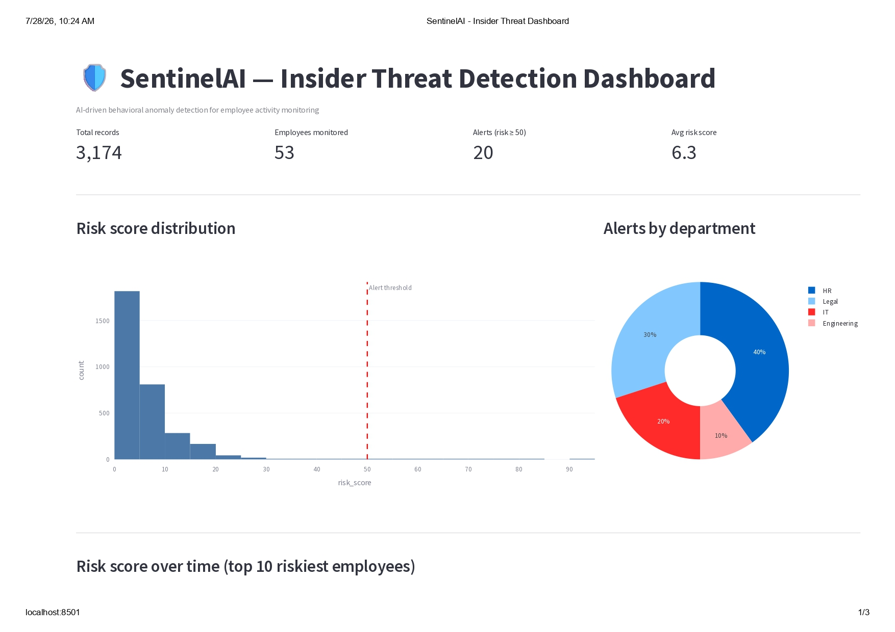
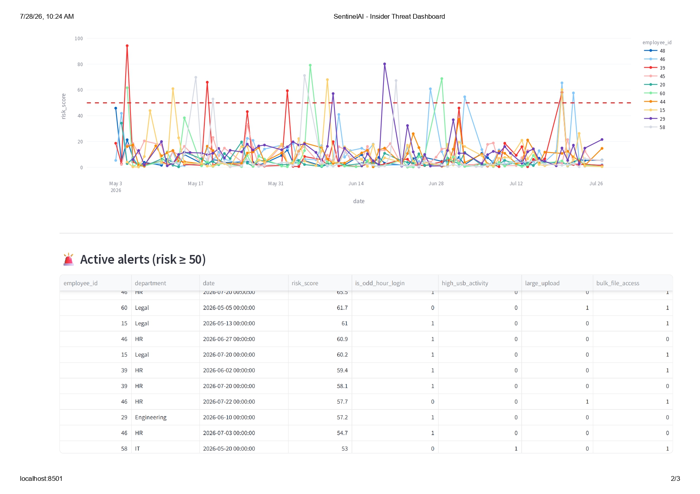
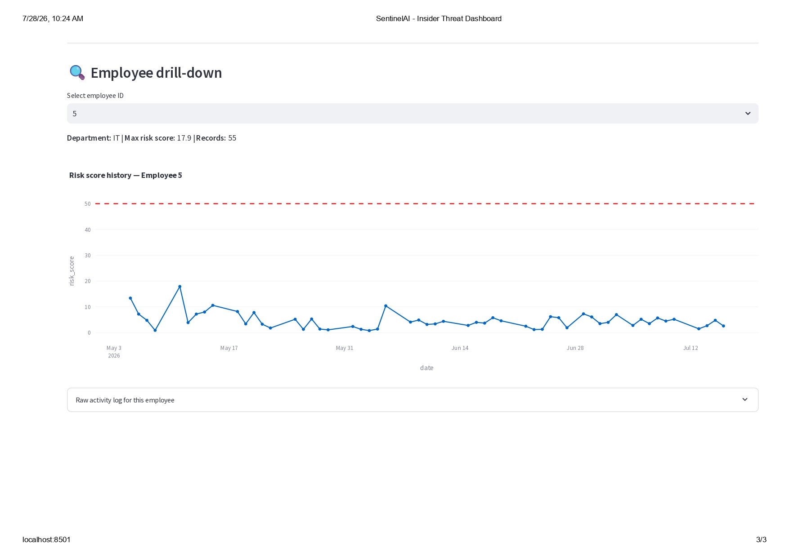

# 🛡️ SentinelAI — AI-Based Insider Threat Detection System

An unsupervised machine learning system that learns each employee's normal
behavioral baseline (login times, file access, USB usage, uploads) and flags
statistically anomalous activity in real time with a 0–100 risk score.

## Dashboard Preview







## Problem

Traditional security tools (firewalls, antivirus) protect against external
attackers but largely miss **insider threats** — legitimate, authenticated
users misusing their access. A signature-based system has nothing to match
against when an employee logs in with valid credentials at 3 AM and copies
thousands of files. Detecting this requires modeling *behavior*, not
signatures.

## Approach

Rather than a supervised classifier (insider threat labels essentially don't
exist in the real world), SentinelAI uses **unsupervised anomaly detection**:

1. Build a rolling 14-day personal behavioral baseline per employee
   (average login hour, file access volume, USB usage, etc.)
2. Convert each day's activity into a deviation (z-score) from that
   employee's *own* baseline — not a global average, since "normal" varies
   hugely by role
3. Feed those deviation features into an ensemble of three anomaly detectors:
   - **Isolation Forest** (sklearn)
   - **Local Outlier Factor** (PyOD)
   - **K-Nearest Neighbors outlier detector** (PyOD)
4. Average the three normalized outlier scores into a single **risk score**
   and surface it through an API and dashboard

## Architecture

```
                 ┌─────────────────┐
                 │  Synthetic Data  │   data/generate_data.py
                 │  Generator       │
                 └────────┬─────────┘
                          │
                 ┌────────▼─────────┐
                 │ Feature Engineering│  features/build_features.py
                 │ (rolling baselines)│
                 └────────┬─────────┘
                          │
                 ┌────────▼─────────┐
                 │  Model Training   │  models/train_model.py
                 │  (IForest+LOF+KNN)│
                 └────────┬─────────┘
                          │
                 ┌────────▼─────────┐
                 │  SQLite Database  │  db/load_to_db.py
                 └────────┬─────────┘
                          │
              ┌───────────┴────────────┐
     ┌────────▼────────┐      ┌────────▼─────────┐
     │  FastAPI Layer   │      │ Streamlit Dashboard│
     │  api/main.py     │      │ dashboard/app.py   │
     └──────────────────┘      └────────────────────┘
```

## Tech Stack

| Component               | Tools                                    |
|-------------------------|-------------------------------------------|
| Data & Features         | pandas, NumPy                             |
| ML / Anomaly Detection  | scikit-learn (Isolation Forest), PyOD (LOF, KNN) |
| API                     | FastAPI                                   |
| Dashboard               | Streamlit, Plotly                         |
| Storage                 | SQLite (swap-in PostgreSQL for production)|
| Deployment              | Docker, docker-compose                    |

## Results

Evaluated against the synthetic ground-truth anomaly labels (used only for
evaluation — the models never see them during training):

| Metric     | Score |
|------------|-------|
| ROC-AUC    | 0.999 |
| Precision  | 0.34  |
| Recall     | 1.00  |
| F1         | 0.51  |

At a 98th-percentile risk threshold, the system catches **100% of injected
insider-threat patterns** (off-hours bulk downloads, USB exfiltration spikes,
mass uploads) while flagging only ~2% of all records for review — a
realistic tradeoff for a real security team's alert queue.

> **Note:** precision looks modest by classifier standards, but in anomaly
> detection this is normal and expected — the system is intentionally tuned
> to prioritize catching every real threat (recall) over minimizing false
> alarms, since missing an insider threat is far costlier than an analyst
> spending a minute reviewing a false positive.

## Getting Started

### 1. Local (no Docker)

```bash
pip install -r requirements.txt

# Run the pipeline once, in order
python data/generate_data.py
python features/build_features.py
python models/train_model.py
python db/load_to_db.py

# Start the API
uvicorn api.main:app --reload --port 8000
# Visit http://localhost:8000/docs

# In a second terminal, start the dashboard
streamlit run dashboard/app.py
# Visit http://localhost:8501
```

### 2. Docker

```bash
docker-compose up --build
# API:       http://localhost:8000/docs
# Dashboard: http://localhost:8501
```

## Project Structure

```
sentinelai/
├── data/
│   ├── generate_data.py       # synthetic employee activity log generator
│   └── raw/employee_logs.csv
├── features/
│   ├── build_features.py      # rolling personal-baseline feature engineering
│   └── processed/employee_features.csv
├── models/
│   ├── train_model.py         # trains IForest + LOF + KNN, computes risk score
│   └── artifacts/              # saved model files (.joblib)
├── db/
│   ├── schema.sql
│   └── load_to_db.py
├── api/
│   └── main.py                 # FastAPI endpoints
├── dashboard/
│   └── app.py                  # Streamlit dashboard
├── artifacts/
│   └── risk_scores.csv         # final per-record risk scores
├── Dockerfile
├── docker-compose.yml
└── requirements.txt
```

## Limitations & Future Work

- **Synthetic data**: real deployment would need real (anonymized) employee
  activity logs, ideally validated against a dataset like the CERT Insider
  Threat dataset
- **Contamination parameter**: currently a fixed assumption (2%); a real
  system would tune this per-organization or use a percentile-based
  threshold reviewed periodically by the security team
- **Explainability**: risk scores could be paired with SHAP values to tell
  an analyst *which* behavioral feature drove the alert
- **Feedback loop**: analyst-confirmed true/false positives could be fed
  back to recalibrate thresholds over time

## Author's Note

This project was built to demonstrate an end-to-end ML system: synthetic
data generation with controlled ground truth, feature engineering grounded
in domain reasoning (personal baselines vs. global averages), an ensemble
of complementary unsupervised models, and a full serving layer (API +
dashboard + persistent storage), containerized for deployment.
